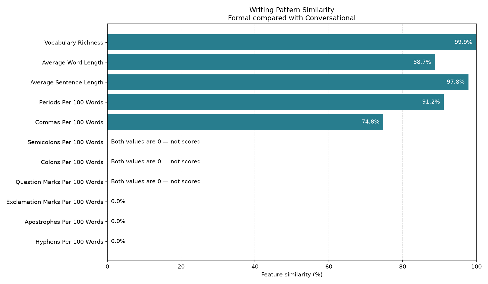

# Writing Pattern Analyzer

An educational Python application that extracts stylometric features, compares
two writing samples, prints a readable report, and creates a per-feature
similarity chart.

## Important limitation

This project cannot determine whether a document was written by artificial
intelligence. Stylometric measurements can identify patterns and similarities,
but they cannot reliably establish authorship or prove academic misconduct.

The results are not probabilities and must never be used as the sole basis for
disciplinary, employment, or legal decisions.

## Example visualization



Jointly absent features are marked as **not scored** rather than displayed as
100% similar.

## Features

The application currently measures:

- Total and unique word counts
- Vocabulary richness
- Average word length
- Detected sentence count
- Average sentence length
- Selected punctuation marks per 100 words
- Scale-independent similarity for each comparable feature

It also provides:

- UTF-8 `.txt` file loading
- Input validation and helpful errors
- A formatted Terminal comparison report
- PNG chart generation
- A tested command-line interface
- Local analysis without uploading writing samples

## How comparison works

Each sample is converted into a stylometric feature profile. Comparable
features are evaluated independently with this scale-independent formula:

```text
similarity = 1 - absolute_difference / (sample_a + sample_b)
```

A result near `1.0` means that one feature has similar values in both samples.
It does not mean the samples share an author or have the same origin.

If both feature values are zero, the visualization marks that feature as
**not scored**. The application deliberately avoids presenting one overall
AI-detection or authorship score.

## Requirements

- Python 3.10 or newer
- Matplotlib

## Installation

Clone the CyberLaunch repository:

```bash
git clone https://github.com/KevinHighlander/CyberLaunch.git
cd CyberLaunch/writing-pattern-analyzer
```

Create and activate a virtual environment:

```bash
python3 -m venv .venv
source .venv/bin/activate
```

Install the project in editable mode:

```bash
python -m pip install -e .
```

Editable mode allows source-code changes to take effect without reinstalling
the package.

## Usage

Compare two UTF-8 text files:

```bash
writing-pattern-analyzer sample-a.txt sample-b.txt
```

Provide readable sample names and choose the output location:

```bash
writing-pattern-analyzer \
  data/samples/formal_sample.txt \
  data/samples/conversational_sample.txt \
  --name-a Formal \
  --name-b Conversational \
  --output output/formal-vs-conversational.png
```

View all available options:

```bash
writing-pattern-analyzer --help
```

The command prints a comparison table, saves a PNG chart, and displays an
educational-use notice.

## Demonstration samples

The repository includes two intentionally styled demonstration samples about
software security updates:

- `data/samples/formal_sample.txt`
- `data/samples/conversational_sample.txt`

They cover the same topic and have similar lengths so the exercise emphasizes
deliberate differences in writing style. They are not labeled human-versus-AI
training data.

Do not commit private coursework, identifying information, or writing samples
that you do not have permission to publish.

## Testing

Activate the virtual environment and run:

```bash
python -m unittest discover -s tests -v
```

The automated suite covers feature extraction, edge cases, file loading,
comparison calculations, reporting, visualization, and command-line behavior.

## Project structure

```text
writing-pattern-analyzer/
├── data/
│   └── samples/
│       ├── conversational_sample.txt
│       └── formal_sample.txt
├── docs/
│   └── images/
│       └── example-similarity.png
├── src/
│   └── writing_pattern_analyzer/
│       ├── __init__.py
│       ├── cli.py
│       ├── comparison.py
│       ├── features.py
│       ├── file_io.py
│       ├── reporting.py
│       └── visualization.py
├── tests/
│   ├── test_cli.py
│   ├── test_comparison.py
│   ├── test_features.py
│   ├── test_file_io.py
│   ├── test_reporting.py
│   └── test_visualization.py
├── DEVLOG.md
├── README.md
├── main.py
├── pyproject.toml
└── requirements.txt
```

Generated folders such as `.venv/`, `output/`, `__pycache__/`, and
`*.egg-info/` are intentionally excluded from Git.

## Known limitations

- The sentence tokenizer uses punctuation rules and may split abbreviations,
  initials, or decimal numbers incorrectly.
- Vocabulary richness is affected by document length.
- Very short samples can produce unstable measurements.
- Topic, genre, editing, and assignment instructions can influence features.
- Aggregate stylometric measurements do not capture every writing habit.
- Current or edited AI output may differ substantially from older datasets.
- Feature similarity cannot establish authorship or AI involvement.

## Ethical use

Appropriate uses include:

- Learning Python and stylometry
- Exploring how deliberate style choices affect measurements
- Comparing drafts written with the author’s permission
- Demonstrating testing, reporting, and visualization techniques

Inappropriate uses include:

- Automatically accusing someone of misconduct
- Treating similarity as proof of authorship
- Making disciplinary decisions from the output
- Analyzing or publishing private writing without permission

## Development journal

The [development journal](DEVLOG.md) records the project’s incremental
exercises, debugging discoveries, design decisions, and methodological
limitations.

## Future improvements

- More language-aware sentence tokenization
- Additional stylometric features
- CSV or JSON report export
- Batch analysis for research datasets
- Comparisons across controlled sample groups
- Improved accessibility and chart customization

## Project status

Version `0.1.0` — functional educational release.